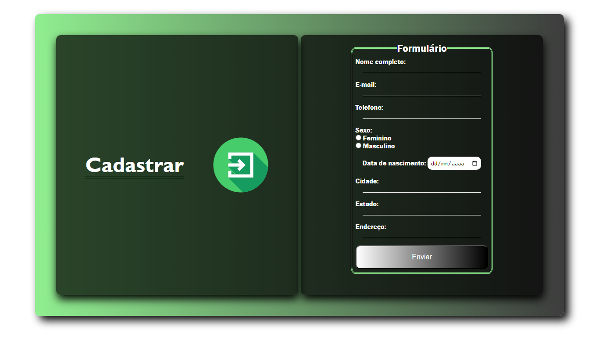

# Projeto: Formulário

## Ideia inicial na criação do projeto
- Treinamento de conceitos avançados de Css.
- Utilização de animações para um visual muito mais agradável.
- Compreendimento e entendimentos avançados a respeito de FlexBox e unidades de medidas.
---
## Tecnologias Utilizadas
- HTML
- CSS
---
## Créditos
- Autor Wesley da Silva
- Inspiração: Projeto do Youtube, Canal Gustavo Neitzke (https://youtu.be/QOeDE7nPDq0)
